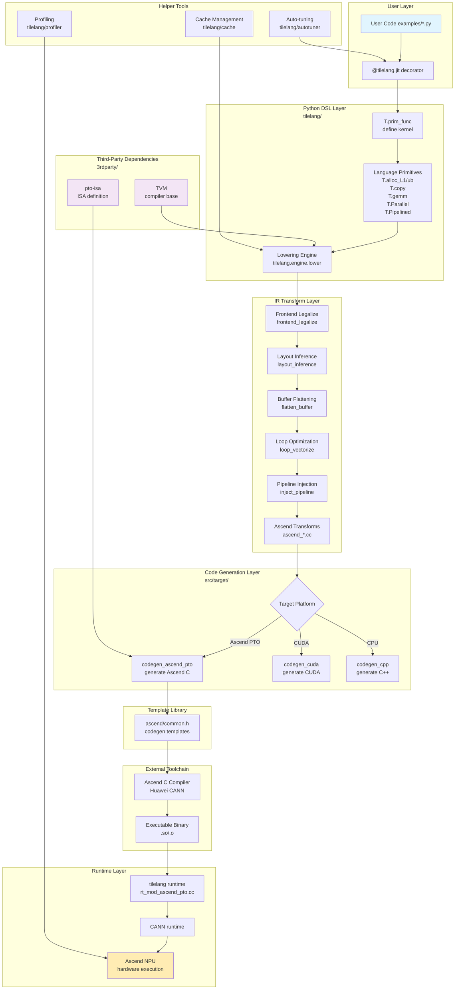

# TileLang-Ascend - AI Agent Guide

> **For AI Agents (Claude Code, OpenCode, etc.)**
> 
> This document provides architecture guidance and coding conventions for the TileLang-Ascend project.

---

## Quick Reference for AI Agents

### Common File Locations
- **User examples**: `examples/` - Look here for usage patterns
- **Python DSL**: `tilelang/` - Main Python API and language constructs
- **C++ backend**: `src/` - Core compiler implementation
- **Tests**: `testing/python/test_*.py` - Python tests
- **Documentation**: `docs/` - Detailed documentation

### Common Commands
```bash
# Run Python tests
pytest testing/python/test_*.py

# Run specific test
pytest testing/python/test_gemm.py

# Build C++ components
cd build && cmake .. && make

# Set environment for Ascend
source set_env.sh
```

### Code Conventions
- **Python**: Follow PEP 8, use type hints
- **C++**: Follow Google C++ Style Guide
- **File naming**: `snake_case` for Python, `snake_case.cc` for C++
- **Test naming**: `test_<module>_<feature>.py`

---

## Project Overview

**TileLang-Ascend** is a domain-specific language (DSL) optimized for Huawei Ascend NPU (Neural Processing Unit). It provides a Python-based DSL built on top of TVM compiler infrastructure for creating high-performance AI compute kernels.

**Key Technologies:**
- Python DSL with decorator-based JIT compilation
- TVM-based compiler infrastructure
- Ascend C & PTO instruction set
- Support for GEMM, vector operations, attention mechanisms

**Supported Backends:**
- Ascend C & PTO (primary)
- AscendNPU IR
- CUDA (for compatibility testing)
- CPU/HIP

---

## Directory Structure

```
tilelang-ascend/
├── tilelang/          # Python DSL and compiler frontend (USER API)
├── src/               # C++ backend implementation (CORE COMPILER)
├── 3rdparty/          # Third-party dependencies
├── examples/          # Example code and tutorials (START HERE)
├── docs/              # Project documentation
├── testing/           # Test code
├── benchmark/         # Performance benchmarks
└── maint/             # Maintenance tools and scripts
```

---

## Module Details

### 1. `tilelang/` - Python DSL and Compiler Frontend

**Purpose**: User-facing Python API for writing NPU kernels

**Key Submodules:**

```
tilelang/
├── jit/              # JIT compilation
│   ├── __init__.py   # @tilelang.jit decorator
│   ├── kernel.py     # JITKernel class
│   └── param.py      # Kernel parameter definitions
│
├── language/         # Language primitives
│   ├── tir/          # Tensor IR (AST)
│   ├── proxy.py      # Tensor/buffer proxy objects
│   ├── kernel.py     # Kernel context manager
│   ├── allocate.py   # Memory allocation (alloc_L1, alloc_ub)
│   ├── copy.py       # Data copy primitives
│   ├── gemm.py       # GEMM computation primitives
│   ├── parallel.py   # Parallel computation (T.Parallel)
│   ├── pipeline.py   # Pipeline primitives (T.Pipelined)
│   ├── ascend.py     # Ascend-specific primitives
│   └── ascend_tile.py # Ascend Tile operations
│
├── engine/           # Compilation engine
│   ├── lower.py      # Lowering engine: TIR → optimized TIR
│   ├── param.py      # Kernel parameter management
│   └── callback.py   # Post-processing callbacks
│
├── transform/        # IR transformation passes (Python)
├── autotuner/        # Auto-tuning for optimal parameters
├── carver/           # Core scheduler and resource mapping
├── layout/           # Memory layout definitions
├── primitives/       # Low-level computation primitives
│   └── gemm/         # GEMM base primitives
├── contrib/          # Extensions and third-party integrations
├── utils/            # Utility functions and type definitions
├── cache/            # Compilation cache management
├── profiler/         # Performance profiling tools
└── __init__.py       # Module entry point, exports main API
```

**Key APIs to Remember:**
- `@tilelang.jit` - JIT compilation decorator
- `T.alloc_L1` - L1 buffer allocation (Cube core)
- `T.alloc_ub` - Unified Buffer allocation (Vector core)
- `T.alloc_L0A/L0B/L0C` - L0 register allocation
- `T.copy` - Data copy primitive
- `T.gemm` / `T.mma` - Matrix multiplication
- `T.Parallel` - Vectorization
- `T.Pipelined` - Pipeline scheduling
- `T.printf` - Debug printing
- `T.dump_tensor` - Debug tensor dumping

---

### 2. `src/` - C++ Backend Implementation

**Purpose**: Core compiler IR transformations, code generation, and runtime support

**Key Subdirectories:**

```
src/
├── ir.cc                      # IR structure definitions and extensions
│
├── tl_templates/              # Code generation templates
│   ├── ascend/                # Ascend-specific templates
│   │   ├── common.h           # Common headers
│   │   └── printf.h           # Debug print templates
│   ├── cuda/                  # CUDA codegen templates
│   ├── hip/                   # HIP/ROCm codegen templates
│   ├── cpu/                   # CPU codegen templates
│   └── pto/                   # PTO instruction templates
│
├── transform/                 # IR transformation passes (C++)
│   ├── frontend_legalize.cc   # Frontend legalization
│   ├── layout_inference.cc    # Layout inference
│   ├── flatten_buffer.cc      # Buffer flattening
│   ├── loop_vectorize.cc      # Loop vectorization
│   ├── inject_pipeline.cc     # Pipeline injection
│   ├── lower_tile_op.cc       # Tile operation lowering
│   ├── ascend_combinecv.cc           # AIC/AIV core merging
│   ├── ascend_lower_parallel_to_vector.cc  # Parallel → Vector lowering
│   ├── ascend_memory_planning.cc     # Memory planning
│   ├── ascend_sync_insert.cc         # Sync instruction insertion
│   └── ascend_host.cc                # Ascend host-side handling
│
├── target/                    # Target code generation
│   ├── codegen_ascend.cc      # Ascend C code generator
│   ├── codegen_ascend_pto.cc  # Ascend PTO code generator
│   ├── codegen_cuda.cc        # CUDA code generator
│   ├── codegen_hip.cc         # HIP code generator
│   ├── codegen_cpp.cc         # C++ code generator
│   ├── codegen_webgpu.cc      # WebGPU code generator
│   ├── rt_mod_ascend.cc       # Ascend runtime module
│   ├── rt_mod_ascend_pto.cc   # Ascend PTO runtime module
│   ├── rt_mod_cuda.cc         # CUDA runtime module
│   ├── rt_mod_hip.cc          # HIP runtime module
│   ├── rt_mod_cpp.cc          # C++ runtime module
│   └── utils.cc               # Target utilities
│
├── runtime/                   # Runtime support (CUDA/Ascend)
├── layout/                    # Layout handling (C++)
└── op/                        # Operation definitions and lowering
```

**Key Transformation Passes:**
- `frontend_legalize` - Normalize IR structure
- `layout_inference` - Infer optimal memory layouts
- `flatten_buffer` - Flatten multi-dimensional buffers
- `loop_vectorize` - Vectorize loops
- `inject_pipeline` - Inject pipeline stages
- `ascend_lower_parallel_to_vector` - Lower Parallel to Vector ops
- `ascend_memory_planning` - Automatic memory planning
- `ascend_sync_insert` - Automatic sync insertion
- `ascend_combinecv` - Merge AIC/AIV cores

---

### 3. `3rdparty/` - Third-Party Dependencies

```
3rdparty/
├── tvm/                  # TVM compiler infrastructure (forked/modified)
├── pto-isa/              # PTO (Packet Tensor Operator) ISA definitions
├── cutlass/              # NVIDIA CUTLASS matrix multiplication library
├── composable_kernel/    # AMD Composable Kernel library
├── catlass/              # CUTLASS variant
└── shmem/                # Shared memory implementation
```

**Critical Dependencies:**
- **TVM** - Core compiler infrastructure (IR, scheduling, codegen)
- **pto-isa** - Ascend PTO instruction set architecture

---

### 4. `examples/` - Example Code

**Purpose**: Demonstrates how to use TileLang-Ascend for various operators

**Key Examples:**

```
examples/
├── gemm/                      # Matrix multiplication
│   ├── example_gemm.py        # Basic GEMM
│   ├── example_gemm_intrinsic.py  # High-performance GEMM with intrinsics
│   └── example_gemm_aot.py    # AOT compilation example
│
├── elementwise/               # Element-wise operations
│   └── vec_add.py             # Vector addition
│
├── flash_attention/           # Flash Attention implementations
│   ├── flash_attn_bhsd.py     # BSHD layout Flash Attention
│   ├── flash_attn_bhsd_developer.py  # Developer mode
│   └── flash_attn_bshd_pipeline.py   # Pipeline-optimized version
│
├── sparse_flash_attention/    # Sparse Flash Attention
├── lightning_indexer/         # Lightning indexer
│
├── pipeline/                  # Pipeline examples
│   ├── matmul_add_pipeline.py
│   └── flash_attn_bshd_pipeline.py
│
├── softmax/                   # Softmax operator
├── reduce/                    # Reduction operators
├── activation/                # Activation functions
├── normalization/             # Normalization layers
├── convolution/               # Convolution operators
├── grouped_gemm/              # Grouped GEMM
├── gemv/                      # Matrix-vector multiplication
├── quant_batch_matmul/        # Quantized batch matmul
├── autotune/                  # Auto-tuning examples
├── developer_mode/            # Developer mode examples
├── print/                     # Debug tool examples (T.printf, T.dump_tensor)
└── torch_tl_ascend/           # PyTorch integration examples
```

**When Adding New Features:**
1. Create example in `examples/` directory
2. Follow existing naming conventions
3. Include comments explaining the implementation
4. Add to relevant test suite

---

### 5. `docs/` - Project Documentation

```
docs/
├── index.md                   # Documentation home
├── get_started/               # Getting started guide
│   ├── Installation.md        # Installation instructions
│   └── overview.md            # Project overview
│
├── tutorials/                 # Tutorials
│   ├── writing_kernels_with_tilelibrary.md
│   ├── writing_kernels_with_thread_primitives.md
│   ├── annotate_memory_layout.md
│   ├── debug_tools_for_tilelang.md
│   ├── auto_tuning.md
│   ├── jit_compilation.md
│   ├── pipelining_computations_and_data_movements.md
│   ├── t_parallel.md          # T.Parallel tutorial
│   ├── t_pipelied.md          # T.Pipelined tutorial
│   └── automatic_workspace_allocation.md
│
├── deeplearning_operators/    # Deep learning operator docs
│   ├── elementwise.md
│   ├── gemv.md
│   ├── matmul.md
│   ├── matmul_dequant.md
│   ├── flash_attention.md
│   ├── flash_linear_attention.md
│   ├── deepseek_mla.md
│   ├── convolution.md
│   └── tmac_gpu.md
│
├── language_ref/              # Language reference
│   ├── ast.md                 # AST documentation
│   ├── primitives.md          # Primitive reference
│   └── tilelibrary.md         # Tile library reference
│
└── api/                       # API reference
    └── modules.md
```

---

### 6. `testing/` - Test Code

```
testing/
├── python/                    # Python unit tests
│   └── test_*.py
└── cpp/                       # C++ unit tests
```

**Test Naming Convention:**
- `test_<module>_<feature>.py` - e.g., `test_gemm_basic.py`, `test_flash_attention.py`

**Running Tests:**
```bash
# Run all Python tests
pytest testing/python/

# Run specific test file
pytest testing/python/test_gemm.py

# Run with verbose output
pytest testing/python/ -v

# Run specific test
pytest testing/python/test_gemm.py::test_gemm_basic
```

---

### 7. `benchmark/` - Performance Benchmarks

Contains performance testing scripts for measuring operator performance.

---

### 8. Important Root Files

```
├── setup.py                   # Python package installation
├── CMakeLists.txt             # C++ build configuration
├── install_ascend.sh          # Ascend platform installation script
├── set_env.sh                 # Environment variable setup
├── requirements*.txt          # Python dependencies
├── pyproject.toml             # Python project configuration
├── VERSION                    # Version number
├── LICENSE                    # MIT License
└── README.md                  # English README
```

---

## Compilation Flow

### User Code → Executable Binary

```
1. User Code Layer
   └── examples/*.py (Python DSL with @tilelang.jit)
            ↓
2. Python DSL Layer
   └── tilelang/
       ├─ @tilelang.jit decorator
       ├─ T.prim_func (define kernel)
       ├─ T.alloc_L1/ub (memory allocation)
       ├─ T.copy/T.gemm (computation primitives)
       ├─ T.Parallel/T.Pipelined (parallel/pipeline)
       └─ tilelang.engine.lower (lowering engine)
            ↓
3. IR Transformation Pass Layer
   └── src/transform/ + tilelang/transform/
       ├─ frontend_legalize (normalize IR)
       ├─ layout_inference (infer layouts)
       ├─ flatten_buffer (flatten buffers)
       ├─ loop_vectorize (vectorize loops)
       ├─ inject_pipeline (inject pipelines)
       ├─ ascend_lower_parallel_to_vector (Parallel→Vector)
       ├─ ascend_memory_planning (memory planning)
       ├─ ascend_sync_insert (sync insertion)
       ├─ ascend_combinecv (core merging)
       └─ lower_tile_op (lower tile ops)
            ↓
4. Code Generation Layer
   └── src/target/
       ├─ codegen_ascend_pto.cc (generate Ascend C + PTO)
       ├─ rt_mod_ascend_pto.cc (runtime module)
       ├─ codegen_cuda.cc (generate CUDA for testing)
       └─ rt_mod_*.cc (runtime modules)
            ↓
5. Template Library Layer
   └── src/tl_templates/
       └─ ascend/common.h, printf.h (codegen templates)
            ↓
6. External Compiler
   └── Huawei CANN Toolchain
       ├─ Ascend C Compiler (compile Ascend C)
       └─ PTO Assembler (process PTO instructions)
            ↓
7. Executable Binary
   └── .so or .o files
            ↓
8. Runtime Execution
   └── tilelang runtime + CANN runtime
       └─ Execute on Ascend NPU
```

---

## Architecture Diagram



---

## Key Technical Features

### 1. Dual Backend Support
- **Ascend C & PTO**: Uses Ascend C language and PTO (Packet Tensor Operator) instructions
- **AscendNPU IR**: Uses NPU IR representation

### 2. Pythonic DSL
- Native Python syntax
- Decorator pattern (`@tilelang.jit`)
- Type hint support

### 3. Hardware Primitive Mapping
| Primitive | Hardware Mapping |
|-----------|-----------------|
| `alloc_L1` | L1 buffer (Cube core) |
| `alloc_ub` | Unified Buffer (Vector core) |
| `alloc_L0A/L0B/L0C` | L0 registers |
| `T.gemm` / `T.mma` | Matrix multiplication accelerator |
| `T.Parallel` | Vectorization instructions |
| `T.Pipelined` | Pipeline scheduling |

### 4. Compiler Optimizations
- **Auto Sync Insertion**: `TL_ASCEND_AUTO_SYNC`
- **Auto Memory Planning**: `TL_ASCEND_MEMORY_PLANNING`
- **Auto Core Sync**: `TL_ASCEND_AUTO_CV_SYNC`
- **Pipeline Optimization**: Overlap computation and data transfer

### 5. Advanced Features
- **Auto Workspace Allocation**: `workspace_idx` parameter
- **Debug Tools**: `T.printf`, `T.dump_tensor`
- **Layout Annotation**: `T.annotate_layout`
- **Address Annotation**: `T.annotate_address`

---

## Environment Variables

Key environment variables for development:

```bash
# Ascend toolkit path
ASCEND_TOOLKIT_HOME=/path/to/ascend/kit

# Python path
PYTHONPATH=/path/to/tilelang-ascend:$PYTHONPATH

# Ascend runtime path
LD_LIBRARY_PATH=$ASCEND_TOOLKIT_HOME/lib64:$LD_LIBRARY_PATH

# Auto-optimization flags
TL_ASCEND_AUTO_SYNC=1
TL_ASCEND_MEMORY_PLANNING=1
TL_ASCEND_AUTO_CV_SYNC=1
```

---

## Common Development Tasks

### Adding a New Operator

1. **Define Python API** in `tilelang/language/`
2. **Implement lowering** in `src/transform/` or `tilelang/transform/`
3. **Add code generation** in `src/target/`
4. **Create example** in `examples/`
5. **Write tests** in `testing/python/`
6. **Update documentation** in `docs/`

### Adding a New Transformation Pass

1. **Create pass file** in `src/transform/` (C++) or `tilelang/transform/` (Python)
2. **Register pass** in appropriate pass manager
3. **Write tests** to verify correctness
4. **Add to lowering pipeline** if needed

### Debugging Compilation Issues

1. Enable debug output: `export TL_DEBUG=1`
2. Use `T.printf` in kernel code
3. Use `T.dump_tensor` to inspect tensors
4. Check generated Ascend C code in build directory
5. Use developer mode for detailed IR dumps

---

## Code Style Guidelines

### Python
- Follow PEP 8
- Use type hints for function signatures
- Maximum line length: 100
- Use docstrings for public APIs

### C++
- Follow Google C++ Style Guide
- Use clang-format for formatting
- Maximum line length: 100
- Add comments for non-trivial logic

### File Naming
- Python: `snake_case.py`
- C++: `snake_case.cc`, `snake_case.h`
- Tests: `test_<module>_<feature>.py`

---

## Getting Help

- **Documentation**: See `docs/` directory
- **Examples**: See `examples/` directory
- **Issues**: Check GitHub issues
- **Code Patterns**: Study existing examples in `examples/`

---

## Summary for AI Agents

**When working on this project:**

1. **Start with examples** - Look at `examples/` to understand usage patterns
2. **Follow conventions** - Use the file naming and code style guidelines
3. **Write tests** - Add tests in `testing/python/` for new features
4. **Update docs** - Keep documentation in sync with code changes
5. **Check both layers** - Changes may require updates in both Python (`tilelang/`) and C++ (`src/`)
6. **Use primitives** - Leverage existing primitives in `tilelang/language/`
7. **Mind the hardware** - Remember Ascend NPU constraints and features

**Key files to understand:**
- `tilelang/__init__.py` - Main API exports
- `tilelang/jit/__init__.py` - JIT compilation entry point
- `tilelang/engine/lower.py` - Lowering pipeline
- `src/target/codegen_ascend_pto.cc` - Code generation
- `examples/gemm/example_gemm.py` - Basic usage pattern

**Testing before committing:**
- Run relevant tests in `testing/python/`
- Check code style with linters
- Verify examples still work
- Test on Ascend hardware if available
